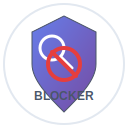
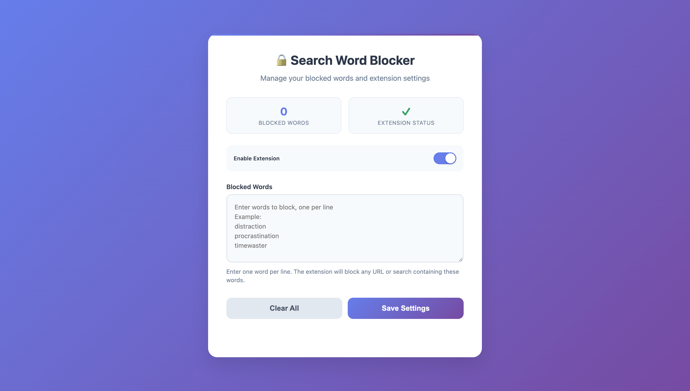

# 🔒 Search Word Blocker

A powerful Chrome extension that helps you stay focused by blocking distracting searches and URLs containing specified words.




## ✨ Features

- **🚫 Comprehensive Blocking**: Blocks searches and URLs containing banned words across multiple search engines
- **🔄 Real-time Filtering**: Instantly redirects blocked searches to keep you focused
- **⚙️ Beautiful Settings Page**: Modern, intuitive interface for managing blocked words
- **🎛️ Quick Toggle**: Easy on/off switch via popup interface
- **➕ Quick Add**: Rapidly add new words to block without opening settings
- **📊 Live Statistics**: See blocked word count and extension status at a glance
- **🌐 Multi-Search Engine Support**: Works with Google, Bing, DuckDuckGo, Yahoo, and Baidu
- **💾 Cloud Sync**: Settings sync across all your Chrome browsers
- **⌨️ Keyboard Shortcuts**: Efficient navigation with hotkeys

## 🚀 Installation

### From Source (Developer Mode)

1. **Clone the repository**
   ```bash
   git clone https://github.com/yourusername/search-word-blocker-extension.git
   cd search-word-blocker-extension
   ```

2. **Load in Chrome**
   - Open Chrome and navigate to `chrome://extensions/`
   - Enable "Developer mode" (toggle in top right)
   - Click "Load unpacked"
   - Select the extension folder

3. **Start Using**
   - Click the extension icon in your toolbar
   - Add words you want to block
   - Stay focused! 🎯

### From Chrome Web Store
*Coming soon...*

## 🎯 How It Works

1. **Add Blocked Words**: Enter words or phrases you want to avoid
2. **Browse Normally**: The extension monitors your searches and URL navigation
3. **Automatic Blocking**: When a blocked word is detected, you're redirected to Google's homepage
4. **Stay Focused**: Avoid distracting content and maintain productivity

## 📱 User Interface

### Popup Interface
- **Toggle Switch**: Enable/disable the extension
- **Statistics**: View blocked word count and status
- **Quick Actions**: Manage settings or add words instantly
- **Keyboard Shortcuts**: 
  - `Space/Enter`: Toggle extension
  - `S`: Open settings
  - `Q`: Quick add word

### Settings Page
- **Modern Design**: Beautiful, responsive interface
- **Bulk Management**: Add/edit multiple words at once
- **Real-time Preview**: See word count update as you type
- **Export/Import**: Backup and restore your settings
- **Keyboard Shortcuts**:
  - `Ctrl/Cmd + S`: Save settings
  - `Ctrl/Cmd + Enter`: Save and close

## 🔧 Technical Details

### Supported Search Engines
- **Google** (`q` parameter)
- **Bing** (`q` parameter)
- **DuckDuckGo** (`q` parameter)
- **Yahoo** (`p` parameter)
- **Baidu** (`wd` parameter)
- **Generic** (`query`, `search` parameters)

### URL Checking
The extension checks multiple parts of URLs:
- Domain names
- URL paths
- Query parameters
- URL fragments

### Permissions Required
- `tabs`: To redirect blocked searches
- `storage`: To save your blocked words
- `webNavigation`: To monitor URL changes
- `<all_urls>`: To check all websites

## 📁 Project Structure

```
search-word-blocker-extension/
├── manifest.json          # Extension configuration
├── background.js          # Core blocking logic
├── popup.html            # Popup interface
├── popup.js              # Popup functionality
├── settings.html         # Settings page
├── settings.js           # Settings functionality
├── logo.svg              # Main logo (128x128)
├── icon-16.svg           # Small icon (16x16)
├── icon-48.svg           # Medium icon (48x48)
└── README.md             # This file
```

## 🛠️ Development

### Prerequisites
- Chrome browser
- Basic knowledge of HTML, CSS, JavaScript
- Text editor or IDE

### Local Development
1. Make changes to the source files
2. Go to `chrome://extensions/`
3. Click the refresh icon on your extension
4. Test your changes

### Building for Production
No build process required - the extension runs directly from source files.

## 🤝 Contributing

Contributions are welcome! Here's how you can help:

1. **Fork the repository**
2. **Create a feature branch**
   ```bash
   git checkout -b feature/amazing-feature
   ```
3. **Make your changes**
4. **Commit your changes**
   ```bash
   git commit -m 'Add amazing feature'
   ```
5. **Push to the branch**
   ```bash
   git push origin feature/amazing-feature
   ```
6. **Open a Pull Request**

### Development Guidelines
- Follow existing code style
- Test thoroughly before submitting
- Update documentation if needed
- Keep commits focused and descriptive

## 📝 License

This project is licensed under the MIT License.

## 🐛 Bug Reports & Feature Requests

Found a bug or have a feature idea? Please open an issue on GitHub:

- **Bug Reports**: Include steps to reproduce, expected behavior, and screenshots if applicable
- **Feature Requests**: Describe the feature and why it would be useful

## 📊 Privacy

This extension:
- ✅ Stores data locally in Chrome's sync storage
- ✅ Does not collect personal information
- ✅ Does not send data to external servers
- ✅ Only processes URLs to check for blocked words
- ✅ Open source - you can verify the code

## 🎉 Acknowledgments

- Thanks to all contributors
- Inspired by the need for better focus tools
- Built with modern web technologies

## 📞 Support

- **GitHub Issues**: [Report bugs or request features](https://github.com/prashantpandey9/MindGuard/issues)
- **Documentation**: Check this README for common questions

---

**Stay focused, stay productive!** ✨

Made with ❤️ for productivity enthusiasts 
